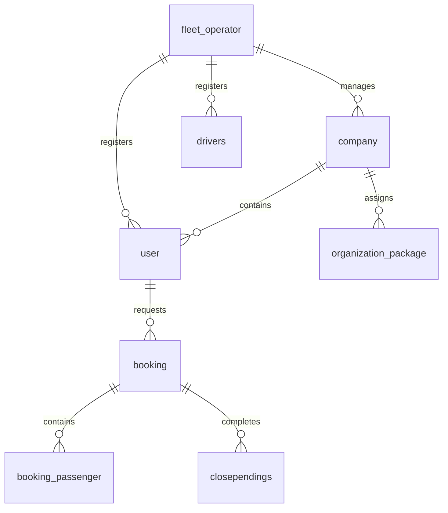

# Current Product Functional & Technical Documentation

This document provides a comprehensive technical and functional specification of the **Fleet & Transport Management Platform** as currently implemented.

---

## 1. Product Overview

The **Fleet & Transport Management Platform** is a multi-tenant SaaS application designed to manage commercial vehicle operations, driver tasks, passenger schedules, and billing cycles. The platform caters to two distinct client models under a single operator:
1. **Individual Customers**: Direct users booking rides on demand.
2. **Organization Clients**: Corporate entities, schools, hospitals, or institutions booking transport for student or staff fleets with custom contract packages.

---

## 2. User / Role Types

The system enforces strict role-based access control (RBAC) at both frontend (Sidebar menus) and backend (JWT verification) levels.

| Role | Who They Are | Key Dashboard Metrics | Accessible Menus |
| :--- | :--- | :--- | :--- |
| **Super Admin / Operator Admin** | Fleet operator owners/internal management. | Available Vehicles, Active Drivers, Active Trips, Pending Invoices, Gross Revenue. | Dashboard, Bookings, Trips, Organizations, Vehicles & Drivers, Packages, Billing, Payments, Reports, Settings |
| **Organization User (Manager)** | Coordinators/Staff at corporate clients (e.g. school registrars). | Scheduled rides, active client trips, pending monthly invoices. | Dashboard, Book Cab, Bookings, Trips, Passengers, Schedules, Invoices, Reports, Profile |
| **Individual Customer** | Direct, public consumers of the transport service. | Quick Booking options, upcoming rides, past receipts. | Home, Book Cab, My Bookings, Track Ride, Payments, Profile |
| **Driver** | Vehicle operators. | Today's assigned tasks, trip status triggers (Start/Complete). | Dashboard, My Trips, Trip History, Profile |
| **Accountant (Staff)** | Fleet operator financial users. | Pending payments, invoices issued, cash vs. online ledger. | Dashboard, Billing, Invoices, Payments, Reports |

---

## 3. Complete Menu Structure

### Operator Admin (Super Admin)
```text
Dashboard
├── Bookings
│   ├── On-Call Bookings
│   ├── Create Booking
│   └── Booking History
├── Trips
│   ├── Active Trips
│   └── Finished Trips
├── Organizations
│   ├── Client List
│   ├── Onboard New Client
│   └── Package Contracts
├── Vehicles & Drivers
│   ├── Vehicle Categories
│   ├── Fleet Assets (Vehicles)
│   └── Driver Registry
├── Packages
│   ├── Pricing Templates
│   └── Custom Overrides
├── Billing & Payments
│   ├── Invoices (Individual & Corporate)
│   └── Payment History
└── Reports
    ├── Overall Revenue
    └── Trip Logs
```

### Organization Manager
```text
Dashboard
├── Book Cab (Bulk Passenger Manifest)
├── Bookings List
├── Trip Status
├── Passenger Roster
└── Monthly Invoices
```

### Individual Customer
```text
Home (Dashboard)
├── Book Cab
├── My Bookings
└── Payment Receipts
```

### Driver
```text
Dashboard (Today's Assigned Trips)
├── My Trips
└── Trip Log History
```

---

## 4. Page Documentation

### Page: Operator Dashboard
*   **Route**: `/dashboard`
*   **Authorized Roles**: `superadmin`, `admin`, `accountant`
*   **UI Components**: Stat cards showing active vehicles, active drivers, today's bookings count, and monthly revenue. 
*   **Tables**: Today's active bookings (columns: Booking ID, Passenger Name, Pickup, Drop, Time, Driver, Status).
*   **APIs**: `GET /api/emp/dashboard-stats`
*   **Models**: `Booking`, `VehicleMaster`, `Drivers`, `Invoice`

### Page: Organization Manager Dashboard
*   **Route**: `/dashboard` (Manager view)
*   **Authorized Roles**: `manager`
*   **UI Components**: Package usage progress bar, upcoming bookings count, monthly invoice balance due.
*   **APIs**: `GET /api/user/company-dashboard/:companyId`
*   **Models**: `Company`, `Booking`, `MonthlyInvoice`

---

## 5. Forms Documentation

### Form: Create Booking (Individual & Corporate)
*   **Page**: `/booking/create`
*   **Authorized Roles**: `superadmin`, `manager`, `user`
*   **API Called**: `POST /api/emp/createBookingForWeb`

| Field | Type | Required? | Purpose | Example |
| :--- | :--- | :--- | :--- | :--- |
| `bookingType` | Select | Yes | Distinguishes booking stream. | `INDIVIDUAL` / `ORGANIZATION` |
| `bookingDate` | Date | Yes | Schedule date. | `2026-08-25` |
| `bookingTime` | Time | Yes | Schedule departure time. | `14:30:00` |
| `pickupPoint` | Text | Yes | Pickup address. | `123 Main St` |
| `dropPoint` | Text | Yes | Destination address. | `456 Cross Rd` |
| `vehicleTypeId` | Select | Yes | Vehicle classification. | `SUV` / `Bus` |
| `travellersCount` | Number | Yes | Total passengers traveling. | `4` |
| `bookingPassengers` | Array | No | Passenger manifest rows. | `[ {name: "John", phone: "123"} ]` |

---

## 6. Authentication & Authorization

All login flows verify credentials dynamically against the database:

```text
User Input (Email + Pass)
      │
      ▼
POST /api/auth/emplogin (or /companyLogin)
      │
      ▼
Query DB (employee, vendor, user, drivers)
      │
      ▼
bcrypt.compare(input, hash_from_db)
      │
      ▼
Generate JWT Payload (userId, role, operatorId, companyId)
      │
      ▼
Redirect Client to Role Dashboard
```

---

## 7. Organization Package Pricing Overrides

The package billing engine overrides default package template rates dynamically when generating client invoices:

*   **Model**: `OrganizationPackage`
*   **Fields**:
    *   `companyId` (UUID)
    *   `packageId` (UUID)
    *   `customBaseAmount` (Decimal)
    *   `customExtraKmRate` (Decimal)
    *   `customExtraHourRate` (Decimal)
    *   `status` (`active` / `inactive`)

When `POST /api/invoiceRoutes/createMonthlyInvoice` is executed:
1. Backend fetches active overrides for the company.
2. If `customBaseAmount` is configured, it replaces the base package price.
3. If extra KMs or hours are clocked, they are multiplied by the custom override rate rather than the master package rate.

---

## 8. Database Schema (`new_ai_cabs_db`)



### Table Specifications

#### `fleet_operator`
*   **PK**: `operatorId` (UUID)
*   **Fields**: `operatorName`, `email`, `gstNumber`, `status`

#### `company` (Organization Clients)
*   **PK**: `companyId` (UUID)
*   **FK**: `operatorId` -> `fleet_operator(operatorId)`
*   **Fields**: `companyName`, `email`, `billingAddress`, `status`

#### `user`
*   **PK**: `userId` (UUID)
*   **FK**: `companyId` -> `company(companyId)` (nullable for individual customers), `operatorId` -> `fleet_operator(operatorId)`
*   **Fields**: `username`, `email`, `password` (bcrypt hash), `role`, `status`

---

## 9. API Reference Table

| Method | Endpoint | Purpose | Required Role | DB Table Affected |
| :--- | :--- | :--- | :--- | :--- |
| `POST` | `/api/auth/emplogin` | Unified database login validation. | Public | `employee` / `vendor` / `user` |
| `POST` | `/api/emp/createBookingForWeb` | Create individual or manifest bookings. | `admin`, `manager`, `user` | `booking`, `booking_passenger` |
| `POST` | `/api/companyRoutes/assignPackage` | Configure client custom pricing contracts. | `admin` | `organization_package` |
| `POST` | `/api/invoiceRoutes/createMonthlyInvoice` | Generate corporate monthly statement. | `admin`, `accountant` | `monthly_invoice`, `monthly_invoice_items` |

---

## 10. Actual Functional Status Matrix

| Feature | Frontend Screen | Backend Endpoint | Database | Working? |
| :--- | :---: | :---: | :---: | :---: |
| Dynamic Database Login | `Yes` | `Yes` | `Yes` | **FULLY WORKING** |
| Individual Cab Booking | `Yes` | `Yes` | `Yes` | **FULLY WORKING** |
| Organization Manifests | `Yes` | `Yes` | `Yes` | **FULLY WORKING** |
| Custom Package Contracts | `Yes` | `Yes` | `Yes` | **FULLY WORKING** |
| Automated Billing Overrides | `Yes` | `Yes` | `Yes` | **FULLY WORKING** |
| Trip Completion Logging | `Yes` | `Yes` | `Yes` | **FULLY WORKING** |
| Invoice PDF Exports | `Yes` | `Yes` | `Yes` | **FULLY WORKING** |

---

## 11. Known Limitations

*   **Payment Gateway Interceptor**: Payments are logged and confirmed manually by accountants/operators in the system; there is no third-party checkout gateway integration currently implemented.
*   **Live Driver GPS Location Tracking**: Active driver routes are logged static via start/stop coordinates; real-time GPS streaming is not currently present in the codebase.
