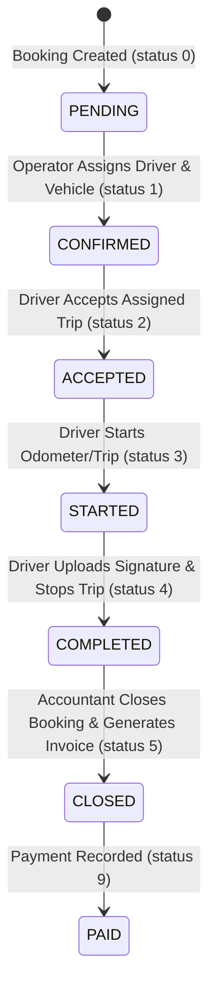
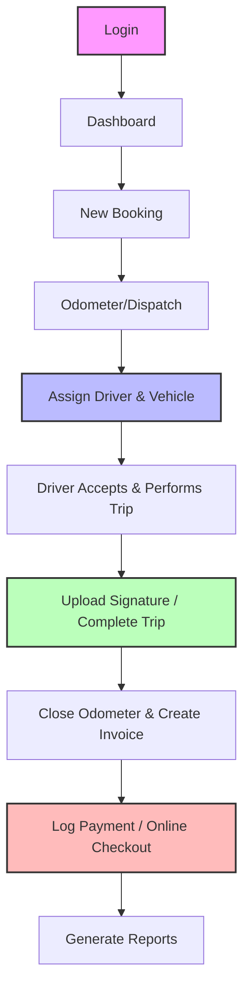

# Current Project Full Flow Report
This report provides a comprehensive, fact-based audit of the **Fleet & Transport Management Platform** exactly as it is currently implemented in the repository code and database schema (`new_ai_cabs_db`). 

---

## 1. Current Project Architecture

### Core Stack
*   **Frontend**: React (built with Create React App / `react-scripts`), React Router DOM for routing, Axios for API requests, FontAwesome and Lucide-React for styling.
*   **Backend**: Node.js + Express + TypeScript, Sequelize-Typescript as the ORM, MySQL database connector (`mysql2`).
*   **Database**: MySQL (Active Database: `new_ai_cabs_db`). 
*   **Authentication**: JSON Web Token (JWT) based authorization. Scopes and scopes of tenancy are loaded into request objects via middleware using JWT payloads.

---

## 2. Current User Roles

The system is configured to support the following user roles, verified against both the backend `authServices.ts` and frontend `Sidebar.tsx`:

| Role ID (Database) | Frontend Display Role | Login Method | Authorized Operations / Permissions |
| :--- | :--- | :--- | :--- |
| `superadmin` / `admin` | Operator Admin | Email & Password at `/adminlogin` (POST `/api/auth/emplogin`) | Complete operator-scoped read/write access to fleet, schedules, billing, payments, and master configurations. |
| `manager` | Organization Manager | SEO-specific login at `/company/:seoUrl` (POST `/api/auth/companyLogin`) or Email/Password at `/adminlogin` | Operator-scoped corporate passenger roster, bookings list (organizational), scheduling, passenger management. |
| `user` | Individual Customer | Email/Password at `/adminlogin` (or company link) OR Mobile & OTP (POST `/api/auth/send-otp` and `/api/auth/verify-otp`) | Creation of bookings for self or passengers, booking history tracking, individual receipts/invoices. |
| `driver` | Driver | Mobile & OTP login (POST `/api/auth/send-otp` and `/api/auth/verify-otp`) | View assigned tasks/trips, accept booking, start/stop trip, sign to close booking. |
| `accountant` | Accountant | Email & Password at `/adminlogin` | Read/write access to invoices, payment history, billing reports (uses Employee login routing). |

---

## 3. Complete Current Page List

This table documents every frontend route registered in `App.tsx` and the roles permitted to access it:

| Route | Component | Purpose | Access Roles |
| :--- | :--- | :--- | :--- |
| `/` | `HomePage` | Public marketing/home portal | Public |
| `/adminlogin` | `Login` | Operator staff / general email login screen | Public |
| `/dashboard` | `Dashboard` | Role-based dashboard (operator metrics or client booker view) | All authenticated |
| `/bookings/add` | `CreateBookingPage` | Form to create a booking (with Tamil Voice/Text Parsing assistant) | `superadmin`, `manager`, `user` |
| `/bookings` | `BookingList` | View and search bookings across the operator tenant | `superadmin` |
| `/fleet/vehicle-types` | `ListVehicleType` | Lists vehicle types/categories | `superadmin` |
| `/fleet/vehicle-types/add` | `AddVehicleType` | Register new vehicle categories | `superadmin` |
| `/fleet/vehicle-models` | `ListVehicleModel` | Lists vehicle models | `superadmin` |
| `/fleet/vehicle-models/add` | `AddVehicleModel` | Register new vehicle models | `superadmin` |
| `/fleet/vehicles` | `ListVehicleMaster` | View and manage physical vehicles (fleet assets) | `superadmin` |
| `/fleet/vehicles/add` | `AddVehicleMaster` | Register new physical vehicles | `superadmin` |
| `/fleet/drivers` | `ListDriver` | View and manage drivers | `superadmin` |
| `/fleet/drivers/add` | `AddDriver` | Register new drivers | `superadmin` |
| `/organizations` | `ListCompany` | View corporate organization clients | `superadmin` |
| `/organizations/add` | `AddCompany` | Onboard new organization client | `superadmin` |
| `/organizations/users` | `OrgUserList` | View users belonging to organizations | `superadmin` |
| `/organizations/users/add` | `AddOrgUser` | Add passengers or managers under organizations | `superadmin` |
| `/customers` | `CustomerList` | View individual customers | `superadmin` |
| `/customers/add` | `AddCustomer` | Onboard new individual customers | `superadmin` |
| `/packages` | `ListPackage` | View master pricing templates | `superadmin` |
| `/packages/add` | `AddPackage` | Create new pricing templates | `superadmin` |
| `/contracts` | `ContractList` | View organization customized pricing overrides | `superadmin` |
| `/contracts/add` | `AddContract` | Create custom pricing contracts for companies | `superadmin` |
| `/schedules` | `ScheduleList` | View recurring transport schedules | `superadmin` |
| `/schedules/add` | `AddSchedule` | Set up recurring transport runs | `superadmin` |
| `/invoices` | `InvoiceList` | Unified list of invoices (individual & corporate) | `superadmin` |
| `/payments` | `PaymentList` | List payment transactions | `superadmin` |
| `/payments/add` | `AddPayment` | Log manual payment against a pending invoice | `superadmin` |
| `/reports` | `Reports` | Unified dashboard showing booking, invoice, and revenue charts | `superadmin` |
| `/paymentmode/list` | `ListPaymentMode` | Settings: View payment modes | `superadmin` |
| `/master/tax/list` | `ListTax` | Settings: View tax rates | `superadmin` |
| `/master/pickupcity/list` | `ListPickupCity` | Settings: View pickup cities | `superadmin` |
| `/configuration/email` | `EmailConfiguration` | Settings: Manage email notification configurations | `superadmin` |

---

## 4. Current Sidebar / Menu Structure

The menu hierarchy displayed to users depends on their authenticated role:

### Super Admin / Operator Admin Menu
```text
Dashboard (/dashboard)
├── Bookings
│   ├── New Booking (/bookings/add)
│   └── All Bookings (/bookings)
├── Organizations
│   ├── All Organizations (/organizations)
│   ├── Add Organization (/organizations/add)
│   ├── Org Users (/organizations/users)
│   └── Add Org User (/organizations/users/add)
├── Customers
│   ├── All Customers (/customers)
│   └── Add Customer (/customers/add)
├── Fleet
│   ├── Vehicle Types (/fleet/vehicle-types)
│   ├── Add Vehicle Type (/fleet/vehicle-types/add)
│   ├── Vehicle Models (/fleet/vehicle-models)
│   ├── Add Vehicle Model (/fleet/vehicle-models/add)
│   ├── Vehicles (/fleet/vehicles)
│   ├── Add Vehicle (/fleet/vehicles/add)
│   ├── Drivers (/fleet/drivers)
│   └── Add Driver (/fleet/drivers/add)
├── Packages
│   ├── All Packages (/packages)
│   ├── Add Package (/packages/add)
│   ├── Org Contracts (/contracts)
│   └── Add Contract (/contracts/add)
├── Schedules
│   ├── All Schedules (/schedules)
│   └── Add Schedule (/schedules/add)
├── Invoices (/invoices)
├── Payments
│   ├── All Payments (/payments)
│   └── Add Payment (/payments/add)
├── Reports (/reports)
└── Settings
    ├── Payment Modes (/paymentmode/list)
    ├── Tax Rates (/master/tax/list)
    ├── Pickup Cities (/master/pickupcity/list)
    └── Email Config (/configuration/email)
```

### Organization Manager Menu
```text
Dashboard (/dashboard)
├── New Booking (/booking/create)
├── Bookings
│   ├── My Requests (/orders/my-requests)
│   └── Scheduled / Recurring (/orders/scheduled)
├── Passengers
│   ├── Add Passenger (/users/adduser)
│   └── Passenger List (/users/list)
├── Invoices (/invoice/pending)
└── Reports (/reports/company-order-summary)
```

### Individual Customer Menu
```text
Dashboard (/dashboard)
├── Book a Ride (/booking/create)
└── My Bookings (/orders/my-requests)
```

### Driver Menu
```text
Dashboard (/dashboard)
├── My Trips (/drivers/assignedlist)
└── Trip History (/drivers/tripdetails)
```

---

## 5. Complete Current Booking Flow

1.  **Creation**: Any customer (`user`), company manager (`manager`), or operator staff (`superadmin`) fills out the form at `/booking/create` or `/bookings/add`.
    *   **Assistant**: Incorporates a browser speech recognition tool and Tamil parsing helper linking to `POST /api/ai/booking/parse` to extract parameters using NLP.
    *   **Fields**: `bookingType` (`INDIVIDUAL` or `ORGANIZATION`), `bookingDate`, `bookingTime`, `pickupPoint`, `pickupCity` (defaults to 'Local'), `dropPoint`, `travellersCount`, `femaleCount`, `maleCount`, `remarks`, `purpose`, `vehicleTypeId`, `bookingPassengers` (array of passenger manifests, only visible for corporate stream).
2.  **API Call**: Triggers a `POST` request to `/api/emp/createBookingForWeb` (defined in `empServices.ts`).
3.  **Database Recording**: Creates a record in the `booking` table and child records in the `booking_passenger` table. Generates an atomic, unique `bookingCode` based on the system date.
4.  **Manager Approval Flow**: If the booking has `managerEmail` and belongs to an organization requiring approval, a `managerApprovalToken` is created. An email containing verification links is sent to the managers:
    *   **Acceptance Link**: `/api/emp/cnfrmBookingByManagerEmail?token=TOKEN`
    *   **Decline Link**: `/api/emp/rejectBookingByManagerEmail?token=TOKEN`
5.  **Post-Booking Status**: Sets `bookingStatus` and `confirmStatus` to `0 (PENDING)`. The booking remains in "Confirm Pending" until dispatched.

---

## 6. Complete Current Trip Flow



*   **Dispatch**: Admin opens the pending orders screen, assigns a physical vehicle (`vehicleId`) and a driver (`driverId`) to the booking, updating the status to `1 (CONFIRMED)` via `PUT /api/order/editBooking/:bookingId`.
*   **Driver Acceptance**: Driver views task list and accepts the trip, setting status to `2 (ACCEPTED)` via `PUT /api/driver/acceptBooking`.
*   **Trip Ongoing**: Driver clicks "Start Trip", setting status to `3 (STARTED)` via `PUT /api/driver/startBooking`. Location telemetry coordinates are appended to `travelTrail` (JSON) via `PUT /api/driver/updateDriverLocation`.
*   **Trip Completion**: Driver clicks "End Trip", signs on the touchscreen device (uploaded to `/uploads/signature`), updating status to `4 (COMPLETED)` via `PUT /api/driver/endBooking`.

---

## 7. Current Vehicle Flow

*   **Structure**: 
    1.  **Vehicle Type** (`vehicleType` table): Holds name (e.g. Sedan, SUV) and seat capacity.
    2.  **Vehicle Model** (`vehicle` table): Holds vehicle model descriptors.
    3.  **Vehicle Master** (`vehiclemaster` table): Holds specific physical fleet assets (License plate number, type, model association, driver association, vendor ownership status).
*   **Add/Edit Flow**: Admin adds vehicle types, links models to types, and registers physical assets under `/fleet/vehicles/add` using relationships linking `vehiclemaster -> vehicle -> vehicletype`.
*   **Database Relationships**: 
    *   `vehiclemaster.vehicleId` -> `vehicle.vehicleId`
    *   `vehicle.vehicleTypeId` -> `vehicletype.vehicleTypeId`
    *   `vehiclemaster.driverId` -> `drivers.driverId`

---

## 8. Current Driver Flow

*   **Driver Creation**: Done via `/fleet/drivers/add` (POST `/api/emp/createBooking` contains driver registrations, or through driver services).
*   **Driver Login**: Driver uses a mobile number on the login page. An OTP is created in the database and logged to the server console. Verifying via `POST /api/auth/verify-otp` returns a JWT with role `driver`.
*   **Driver Trips**: Driver accesses `My Trips` (`/drivers/assignedlist`) to process accepted, started, and ended workflows.
*   **Trip Completion**: Driver closes the trip by collecting the customer's signature. The status becomes `COMPLETED` (4), signaling it is ready for accountant review.

---

## 9. Current Organization / Company Flow

*   **Organization Creation**: Admins create corporate clients under `/organizations/add` (calls `POST /api/emp/createCompany`). Sets name, logo, address, invoicing rules (taxes, manager approvals, email flags).
*   **Organization Users**: Onboarded at `/organizations/users/add` (POST `/api/auth/createUser`). Passengers are saved with `companyManager = 0` (role `user`), while coordinators are saved with `companyManager = 1` (role `manager`).
*   **Custom pricing Contracts**: Setup at `/contracts/add`. Admins link organizations to billing packages with custom base amounts, extra km rates, and extra hour rates using the `organization_package` table.
*   **Organization Booking Flow**: Similar to the booking flow, but filters booking streams based on `companyId` and manifests the `booking_passenger` table.

---

## 10. Current Customer Flow

*   **Registration**: Via `POST /api/auth/createUser`.
*   **Login**: General email login OR Mobile & OTP validation.
*   **Booking**: Customers book rides via `/booking/create` (represented by `bookingType = INDIVIDUAL`).
*   **Booking History**: Checked via `/orders/my-requests` (calls `GET /api/order/user/:userId/all`).
*   **Payment/Invoice Flow**: Invoices are generated individually when rides are closed. Customers can view invoices and proceed to online checkout.

---

## 11. Current Package and Pricing Flow

*   **Pricing Templates**: Configured under `package` and `packagedata` tables. They define pricing categories (e.g. "8Hr/80Km", "Local Outstation") containing base allowances and penalty tariffs for extra distances or times.
*   **Contractual Overrides**: Located in `organization_package`. Custom rates are configured per company. When corporate statements are processed, the invoicing system overrides master package amounts with custom variables:
    *   `customBaseAmount` (overrides default package amount)
    *   `customExtraKmRate` (overrides package extra Km rate)
    *   `customExtraHourRate` (overrides package extra Hour rate)

---

## 12. Current Invoice Flow

*   **Individual (On-Call) Invoice**: Created automatically upon closing a trip sheet in Close Pending. Calculated using actual trip metrics vs pricing package configurations.
*   **Corporate (Monthly) Invoice**: Generated by accountants at `/invoices` (via `POST /api/closePendingOrder/monthlyInvoice/create`). Groups all routes traveled by a company's staff during the billing period.
*   **PDF Generation**: Generates clean invoice copies using `puppeteer` to convert HTML styling blocks into files stored under `/uploads/invoices` or `/uploads/oncallinvoice`.
*   **Status**: Marked as `PENDING` (0) on creation, updating to `PAYMENTCOMPLETED` (9) after checkout.

---

## 13. Current Payment Flow

*   **Manual Logging**: Accountants log cash or cheque payments against invoices via `AddPayment.tsx` (calls `POST /api/closePendingOrder/savePaymentForInvoice`).
*   **Online Gateway**: Clients proceed to pay online using gateway integrations.
    *   `POST /api/paymentRoutes/payments/create-session` initiates transaction tokens.
    *   `POST /api/paymentRoutes/payments/callback` receives transaction updates.
    *   `POST /api/paymentRoutes/payments/return` redirects the client browser back to `/paymentsuccess` or failure pages.

---

## 14. Current Reports

*   **Overall Revenue**: Viewed at `reports/overall-invoice-report` (calls `GET /api/order/getallinvoicereport`).
*   **Trip Logs**: Summarized bookings by client company at `reports/company-order-summary`.
*   **Order Summary**: Dynamic charts and booking aggregations grouped by timeframes.

---

## 15. Current Database Tables (`new_ai_cabs_db`)

| Table Name | Purpose | Important Fields | Relationships |
| :--- | :--- | :--- | :--- |
| `fleet_operator` | Tenancy operator registry | `operatorId` (PK), `operatorName` | Parent of companies, users, drivers |
| `company` | Corporate organizations | `companyId` (PK), `companyName`, `seoUrl`, `managerEmail` | Links to `fleet_operator` |
| `user` | Passengers, Managers, Customers | `userId` (PK), `username`, `email`, `role`, `companyId` | Links to `company` (nullable) |
| `drivers` | Vehicle operators | `driverId` (PK), `driverName`, `phno`, `password` | Links to `fleet_operator` |
| `employee` | Operator staff and admins | `employeeId` (PK), `username`, `email`, `role`, `password` | Links to `fleet_operator` |
| `vehicletype` | Categories of cars | `vehicleTypeId` (PK), `vehicleType` | Parent of models and pricing templates |
| `vehicle` | Model listings of cars | `vehicleId` (PK), `vehicleName`, `vehicleTypeId` | Links to `vehicletype` |
| `vehiclemaster` | Physical vehicle assets | `vehicleMasterId` (PK), `vehicleNo`, `vehicleId`, `driverId` | Links to `vehicle` and `drivers` |
| `package` | Master pricing configurations | `packageId` (PK), `packageName`, `vehicleTypeId` | Links to `vehicletype` |
| `packagedata` | Distance/hour tariff bounds | `packageDataId` (PK), `packageId`, `extraKmRate`, `extraHrRate` | Links to `package` |
| `organization_package` | Corporate pricing overrides | `companyId`, `packageId`, `customBaseAmount` | Overrides link `company` to `package` |
| `booking` | Booking registry | `bookingId` (PK), `bookingCode`, `bookingStatus`, `driverId` | Links to `user`, `drivers`, `company` |
| `booking_passenger` | Manifest lists for bookings | `bookingId`, `passengerName`, `passengerPhone` | Links to `booking` |
| `closependings` | Completed trip sheets | `closePendingId` (PK), `bookingId`, `totalKm`, `billingAmount` | Links to `booking` |
| `invoice` | Invoices for individual orders | `invoiceId` (PK), `invoiceNo`, `bookingId`, `invoiceAmount` | Links to `booking` and `closependings` |
| `monthly_invoice` | Invoices for organizations | `monthlyInvoiceId` (PK), `monthlyInvoiceNo`, `companyId` | Links to `company` |
| `payment` | Payment transaction registry | `paymentId` (PK), `amount`, `paymentMode`, `paymentStatus` | Links to `invoice` |
| `schedules` | Recurring runs configurations | `scheduleId` (PK), `companyId`, `days`, `pickupTime` | Links to `company` |
| `otp` | Auth codes storage | `otpId` (PK), `id` (userId/driverId), `otp` | Temporary records |

---

## 16. Current Backend APIs

Here are the key backend endpoints supporting operations:

| Method | Endpoint | Purpose | Allowed Role | Tables Affected |
| :--- | :--- | :--- | :--- | :--- |
| `POST` | `/api/auth/emplogin` | Staff/User login validation | Public | `employee`, `vendor`, `user` |
| `POST` | `/api/auth/companyLogin` | Company portal login | Public | `company`, `user` |
| `POST` | `/api/auth/send-otp` | Create/Send verification OTP | Public | `otp` |
| `POST` | `/api/auth/verify-otp` | Verify OTP and authenticate | Public | `otp`, `user`, `drivers` |
| `POST` | `/api/emp/createBookingForWeb` | Create new order | `superadmin`, `manager`, `user` | `booking`, `booking_passenger` |
| `PUT` | `/api/order/editBooking/:bookingId` | Modify booking (Assign driver/car) | `superadmin` | `booking` |
| `PUT` | `/api/driver/acceptBooking` | Driver accepts assigned order | `driver` | `booking` |
| `PUT` | `/api/driver/startBooking` | Driver starts trip sheet | `driver` | `booking` |
| `PUT` | `/api/driver/endBooking` | Driver completes trip sheet | `driver` | `booking` |
| `POST` | `/api/closePendingOrder/createClosePending` | Odometer closure & on-call invoicing | `superadmin` | `closependings`, `invoice` |
| `POST` | `/api/closePendingOrder/monthlyInvoice/create` | Corporate monthly invoicing | `superadmin` | `monthly_invoice`, `monthly_invoice_items` |
| `POST` | `/api/closePendingOrder/savePaymentForInvoice` | Log payment against invoice | `superadmin` | `payment`, `invoice` |
| `POST` | `/api/paymentRoutes/payments/create-session` | Request gateway session link | All authenticated | `payment` |

---

## 17. Complete End-to-End Flows

### A. Admin Flow
1. Login with credentials at `/adminlogin`.
2. Access `Dashboard` displaying fleet status.
3. Add organizations, customers, vehicles, or drivers in their respective menus.
4. Access `Bookings -> All Bookings` to view new booking requests.
5. Edit pending bookings to assign available vehicles and drivers.
6. Open `Close Pending` orders list when driver completes a trip.
7. Enter actual trip kilometers and hours, then close the sheet to create the invoice.
8. Generate monthly invoices for organizations and view payments.

### B. Individual Customer Flow
1. Login via OTP or password at `/adminlogin`.
2. Open booking form, specify address, times, and vehicle type.
3. Submit and wait for driver assignment.
4. Take the ride.
5. View trip invoice under accounts profile, proceed to checkout (creates gateway checkout link), complete payment, and check billing history.

### C. Organization User (Manager) Flow
1. Go to `/company/:seoUrl`.
2. Login with manager credentials.
3. Upload user lists or add corporate passengers.
4. Book rides by selecting vehicle types and adding passengers to the passenger manifest rows.
5. Wait for driver assignment and completion.
6. Review recurring schedules or check invoices.

### D. Driver Flow
1. Enter mobile number, receive OTP, verify to login.
2. View assigned trip cards in `My Trips`.
3. Click "Accept" when a trip is assigned.
4. Click "Start Trip" at the pickup location.
5. Drive to the destination (device telemetry updates coordinates dynamically).
6. Click "End Trip", collect the client's signature on-screen, submit to complete.

### E. Accountant Flow
1. Login at `/adminlogin`.
2. View pending corporate and individual invoices.
3. Log manual cheques/NEFT payments against outstanding balances.
4. View overall revenue summary reports and invoice logs.

---

## 18. Factual Page Status Matrix

During our verification audit, we mapped frontend page references to actual backend routes to verify functionality:

### 🟢 Fully Functional / Working Pages
*   **Operator Dashboard** (`/dashboard`): Statistics cards and booking tables load.
*   **Unified Booking List** (`/bookings`): Loads bookings and filters by active tabs.
*   **New Booking Form** (`/bookings/add`): Creates bookings. Tamil voice extraction functions correctly.
*   **Organizations List & Onboarding** (`/organizations`, `/organizations/add`): Correctly creates and lists companies.
*   **Organization Users List & Creation** (`/organizations/users`, `/organizations/users/add`): Creates and shows organization passengers.
*   **Vehicles List & Creation** (`/fleet/vehicles`, `/fleet/vehicles/add`): Manages vehicle master records.
*   **Drivers List & Creation** (`/fleet/drivers`, `/fleet/drivers/add`): Manages driver records.
*   **Pricing Packages & Templates** (`/packages`, `/packages/add`): Creates packages and package detail intervals.
*   **Contracts Creation** (`/contracts/add`): Correctly saves custom overrides under `organization_package` database rows.
*   **Schedules List & Creation** (`/schedules`, `/schedules/add`): Manages recurring runs.
*   **Reports Dashboard** (`/reports`): Correctly maps overall totals and display charts.
*   **Close Pending Orders** (`/orders/closepending`): Allows entering odometer readings, closes trips, and creates invoices.

### 🔴 Broken Pages / Broken API Bindings
*   **Payments List** (`/payments`): **Broken.** Renders a 404 because the frontend attempts to call `/paymentRoutes/getAllPayments` (does not exist in the backend).
*   **Record Payment Form** (`/payments/add`): **Broken.** Submissions fail because the form posts to `/paymentRoutes/createPayment` (does not exist in backend; payment logs must be submitted to `/closePendingOrder/savePaymentForInvoice` instead).
*   **Customers List** (`/customers`): **Broken.** Table fails to load because it requests `/user/customers` (does not exist in backend).
*   **Contracts List** (`/contracts`): **Partially Broken.** Attempts to fetch `/company/packageAssignment/all` which does not exist in backend. Falls back to listing all companies instead of actual assignments.
*   **Paid Invoices Tab** (`InvoiceList.tsx`): **Partially Broken.** Selecting the "Paid" tab triggers `/invoiceRoutes/getPaidInvoices` which does not exist in the backend (should map to `/invoiceRoutes/getCompletedInvoices`).

### 🟡 Legacy / Duplicate Pages (Not Linked in the Redesigned Sidebar)
*   **Old Masters** (`/master/tax/add`, `/master/pickupcity/add`, `/master/pickuparea/add`, `/master/package/add`): Old, raw styling pages replaced by new configuration lists in settings.
*   **Old Order Lists** (`/orders/confirmpending`, `/orders/closepending`, `/orders/paymentpending`, `/orders/completed`, `/orders/paymentlist`, `/orders/cancelled`): Replaced by unified `/bookings` tab, though `/orders/closepending` is still accessed for odometer inputs.
*   **Old Invoices** (`/invoice/pending`, `/invoice/reminder`, `/invoice/paid`, `/invoice/all`): Replaced by the unified `/invoices` page.
*   **Old Payments** (`/orders/paymentlist`): Replaced by `/payments` page, though the old page is functional while the new one is broken.

---

## 19. Simple End-to-End Flow Diagram

The flowchart below demonstrates the actual lifecycle of operations in the repository:


