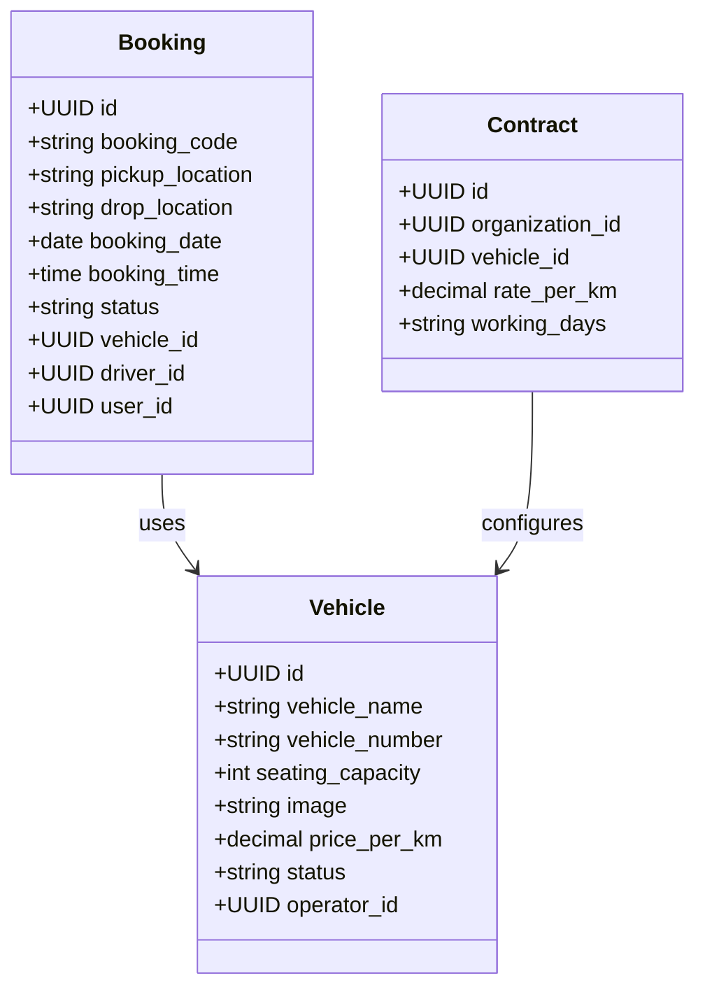

# CURRENT TO TARGET PRODUCT ARCHITECTURE REPORT & MIGRATION MAP

This report is a comprehensive repository analysis and migration blueprint for transforming the **Fleet & Transport Management Platform** from its current Node.js state into a simplified, premium, commercial SaaS platform powered by **Laravel**.

---

## SECTION A: CURRENT REPOSITORY AUDIT

### 1. Current Architecture & Stack
*   **Frontend**: React (SPA using React Router DOM v7), TailwindCSS for layout, Axios for API calls, FontAwesome + Lucide icons. Mounted on `http://localhost:3000`.
*   **Backend**: Node.js, Express, TypeScript (`ts-node`/`ts-node-dev`), Sequelize-TypeScript ORM. Mounted on `http://localhost:5005`.
*   **Database**: MySQL database named `new_ai_cabs_db` containing 39 active tables.
*   **Authentication**: JSON Web Tokens (JWT) stored in localStorage. Security middleware injects tenant parameters (`operatorId`, `companyId`, `userId`) from JWT claims.
*   **Notifications**: Nodemailer for Email. DLT/CTA SMS notifications integration using twilio placeholders and tokenized short-links stored in `shortLink`.
*   **PDF/Excel Generation**: Puppeteer for PDF invoice rendering; `xlsx` / `xlsx-js-style` libraries for spreadsheet summary reports.

---

### 2. Current Database Tables Audit

| Current Table | Purpose | Important Fields | PK / FKs | Relationships | Used APIs | Consumer Pages | Status | Target Action |
| :--- | :--- | :--- | :--- | :--- | :--- | :--- | :--- | :--- |
| `fleet_operator` | Multi-tenant Operator context | `operatorId` | PK: `operatorId` | Parent of users, companies, vehicles, drivers | `/api/auth/emplogin` | Login, Dashboard | Active | **KEEP** (Rename to `operators`) |
| `company` | Corporate client entities | `companyId`, `companyName`, `seoUrl`, `managerEmail` | PK: `companyId` / FK: `operatorId` | BelongsTo Operator; HasMany Users | `/api/emp/createCompany`, `/api/company/getAllCompany` | Organizations, Sidebar | Active | **KEEP** (Rename to `organizations`) |
| `user` | Passengers, Managers, Customers | `userId`, `username`, `email`, `role`, `companyId`, `companyManager` | PK: `userId` / FK: `companyId`, `operatorId` | BelongsTo Company; BelongsTo Operator | `/api/auth/createUser`, `/api/user/:id` | Register, OrgUsers, Customers | Active | **KEEP** (Rebuild in Laravel as `users`) |
| `drivers` | Cab operators | `driverId`, `driverName`, `phno`, `password` | PK: `driverId` / FK: `operatorId` | BelongsTo Operator | `/api/driver/acceptBooking`, `/api/driver/startBooking` | Drivers List, My Trips | Active | **KEEP** (Rename to `drivers`) |
| `employee` | Backoffice admins & accountants | `employeeId`, `username`, `email`, `role` | PK: `employeeId` / FK: `operatorId` | BelongsTo Operator | `/api/auth/emplogin` | Admin Login | Active | **KEEP** (Merge into `users` table via roles) |
| `vehicletype` | Categorization level | `vehicleTypeId`, `vehicleType`, `seatCapacity` | PK: `vehicleTypeId` | Parent of models, physical cars, and packages | `/api/vehicleType/getAllVehicleTypes` | Vehicle Types, Create Booking | Complex | **REMOVE / MERGE** (Consolidate into `vehicles`) |
| `vehicle` | Model descriptors level | `vehicleId`, `vehicleName`, `vehicleTypeId` | PK: `vehicleId` / FK: `vehicleTypeId` | BelongsTo VehicleType; Parent of physical cars | `/api/vehicle/getAllVehicle` | Vehicle Models, Create Booking | Complex | **REMOVE / MERGE** (Consolidate into `vehicles`) |
| `vehiclemaster` | Physical assets level | `vehicleMasterId`, `vehicleNumber`, `vehicleId`, `driverId` | PK: `vehicleMasterId` / FK: `vehicleId`, `driverId` | BelongsTo Vehicle Model; BelongsTo Driver | `/api/vehicle/getAllVehicleMaster` | Vehicles List | Complex | **REMOVE / MERGE** (Consolidate into `vehicles`) |
| `package` | Master pricing configurations | `packageId`, `packageName`, `vehicleTypeId`, `baseKm`, `baseAmount` | PK: `packageId` / FK: `vehicleTypeId` | BelongsTo VehicleType; Parent of package data | `/api/emp/createPackage` | Packages | Complex | **REMOVE** (Replace with simplified per-KM pricing) |
| `packagedata` | Distance/hour limits | `packageDataId`, `packageId`, `extraKmRate`, `extraHrRate` | PK: `packageDataId` / FK: `packageId` | BelongsTo Package | `/api/emp/createPackage` | Packages | Complex | **REMOVE** (Replace with simplified per-KM pricing) |
| `organization_package` | Contract customized overrides | `companyId`, `packageId`, `customBaseAmount`, `customExtraKmRate` | Composite PK / FK: `companyId`, `packageId` | Links Company to Package | `/api/company/packageAssignment/all` | Org Contracts | Complex | **MERGE / RENAME** (Rebuild as `contracts`) |
| `booking` | Bookings ledger | `bookingId`, `bookingCode`, `bookingStatus`, `confirmStatus`, `driverId` | PK: `bookingId` / FK: `userId`, `driverId`, `companyId` | BelongsTo User, Driver, Company | `/api/emp/createBookingForWeb` | Bookings, My Bookings | Active | **KEEP** (Rebuild as `bookings` in Laravel) |
| `booking_passenger` | Manifest lists | `bookingId`, `passengerName`, `passengerPhone` | Composite PK / FK: `bookingId` | BelongsTo Booking | `/api/emp/createBookingForWeb` | Booking Form | Active | **KEEP** (Rebuild as `booking_passengers`) |
| `closependings` | Odometer closure logs | `closePendingId`, `bookingId`, `totalKm`, `billingAmount` | PK: `closePendingId` / FK: `bookingId` | BelongsTo Booking | `/api/closePendingOrder/createClosePending` | Close Pending Orders | Complex | **REMOVE / MERGE** (Consolidate into `bookings`/`trips`) |
| `invoice` | Invoices for individual orders | `invoiceId`, `invoiceNumber`, `invoiceAmount`, `invoiceStatus` | PK: `invoiceId` / FK: `bookingId`, `paymentId` | BelongsTo Booking; BelongsTo Payment | `/api/closePendingOrder/createClosePending` | Invoice details, Payments | Active | **KEEP** (Rebuild as `invoices`) |
| `monthly_invoice` | Invoices for organizations | `monthlyInvoiceId`, `monthlyInvoiceNo`, `companyId`, `totalAmount` | PK: `monthlyInvoiceId` / FK: `companyId` | BelongsTo Company | `/api/closePendingOrder/monthlyInvoice/create` | Corporate Invoices | Active | **KEEP** (Rebuild as `monthly_invoices`) |
| `payment` | Payment transactions ledger | `paymentId`, `amount`, `paymentMode`, `status`, `transactionId` | PK: `paymentId` | Parent of Invoice | `/api/paymentRoutes/payments/create-session` | Payments, Checkout | Active | **KEEP** (Rebuild as `payments`) |
| `schedules` | Recurring schedule configurations | `scheduleId`, `companyId`, `days`, `pickupTime`, `startDate` | PK: `scheduleId` / FK: `companyId` | BelongsTo Company | `/api/schedules` | Schedules | Active | **KEEP** (Rebuild as `schedules`) |
| `pickupcity` | Cities master | `pickupCityId`, `cityName` | PK: `pickupCityId` | Parent of PickupArea | `/api/location/getPickupCity` | Settings | Unused | **REMOVE** (Replaced by manual text locations) |
| `pickuparea` | Areas master | `pickupAreaId`, `areaName`, `pickupCityId` | PK: `pickupAreaId` / FK: `pickupCityId` | BelongsTo PickupCity | `/api/location/getPickupArea` | Settings | Unused | **REMOVE** (Replaced by manual text locations) |
| `otp` | Auth codes storage | `otpId`, `id`, `otp` | PK: `otpId` | Matches userId or driverId | `/api/auth/send-otp` | Login, Register | Active | **KEEP** (Rebuild as `otps`) |

---

### 3. Current Frontend Pages Audit

| Frontend Route | Component File | Role | Purpose | API Used | DB Entities | Target Action |
| :--- | :--- | :--- | :--- | :--- | :--- | :--- |
| `/` | `homepage.tsx` | Public | Public landing marketing page | None | None | **KEEP** (Verify Login/Register buttons) |
| `/adminlogin` | `Login.tsx` | Staff | Operator employee email login screen | `/api/auth/emplogin` | `employee`, `user` | **KEEP** (Admin/Operator Login) |
| `/dashboard` | `Dashboard.tsx` | Admin | Overall operator KPIs dashboard | `/api/order/getAllOrders` | `booking`, `vehicle`, `drivers` | **KEEP** (Simplify Admin Dashboard) |
| `/bookings/add` | `CreateBookingPage.tsx` | Admin | Create ride with Tamil AI assistant parser | `/api/emp/createBookingForWeb`, `/api/ai/booking/parse` | `booking`, `booking_passenger` | **KEEP** (Merge into unified bookings router) |
| `/bookings` | `BookingList.tsx` | Admin | Unified list filtering all ride requests | `/api/order/getAllOrders` | `booking` | **KEEP** (Rebuild with status workflow) |
| `/fleet/vehicles` | `ListVehicleMaster.tsx` | Admin | Manage physical fleet assets | `/api/vehicle/getAllVehicleMaster` | `vehiclemaster` | **SIMPLIFY** (Point to single Vehicles page) |
| `/fleet/drivers` | `ListDriver.tsx` | Admin | Manage drivers | `/api/driver/getAllDrivers` | `drivers` | **KEEP** (Drivers Management) |
| `/organizations` | `ListCompany.tsx` | Admin | Manage corporate companies | `/api/company/getAllCompany` | `company` | **KEEP** (Organizations Management) |
| `/organizations/users` | `OrgUserList.tsx` | Admin | Manage passengers inside organizations | `/api/user/getAllUsers` | `user`, `company` | **KEEP** (Passengers Management) |
| `/contracts` | `ContractList.tsx` | Admin | View customized pricing contracts | `/api/company/packageAssignment/all` | `organization_package` | **SIMPLIFY / REBUILD** (Contract Management) |
| `/schedules` | `ScheduleList.tsx` | Admin | View recurring runs configurations | `/api/schedules` | `schedules` | **KEEP** (Recurring Schedules) |
| `/invoices` | `InvoiceList.tsx` | Admin | List pending/paid statements | `/api/invoiceRoutes/getAllInvoices` | `invoice` | **KEEP** (Invoices Ledger) |
| `/payments` | `PaymentList.tsx` | Admin | List logged payment logs | `/api/paymentRoutes/getAllPayments` | `payment` | **KEEP** (Payments Log) |
| `/reports` | `Reports.tsx` | Admin | Summary of revenues and volumes | `/api/booking/getAllOrders` | `invoice`, `booking` | **KEEP** (Simple Reports) |
| `/master/tax/list` | `ListTax.tsx` | Admin | Settings: Manage tax configurations | `/api/tax/getAllTax` | `tax` | **KEEP** (Merge into Settings) |
| `/master/pickupcity/list` | `ListPickupCity.tsx` | Admin | Settings: Manage cities | `/api/location/getPickupCity` | `pickupcity` | **REMOVE** (Unnecessary location master) |

---

### 4. Current Backend APIs Audit

| Method | Endpoint | Controller / Service | Purpose | Tables Affected | Consumer Page | Auth | Role | Target Action |
| :--- | :--- | :--- | :--- | :--- | :--- | :--- | :--- | :--- |
| `POST` | `/api/auth/emplogin` | `authServices.ts` | Employee auth login | `employee`, `user` | `/adminlogin` | Public | None | **REBUILD IN LARAVEL** |
| `POST` | `/api/auth/userLogin` | `authServices.ts` | Customer email login | `user` | `/login` | Public | None | **REBUILD IN LARAVEL** |
| `POST` | `/api/auth/createUser` | `authServices.ts` | Register new customer | `user` | `/register` | Public | None | **REBUILD IN LARAVEL** |
| `POST` | `/api/auth/send-otp` | `authServices.ts` | Generate/Send mobile OTP | `otp` | Login, Register | Public | None | **REBUILD IN LARAVEL** |
| `POST` | `/api/auth/verify-otp` | `authServices.ts` | Verify OTP and return JWT | `otp`, `user`, `drivers` | Login, Register | Public | None | **REBUILD IN LARAVEL** |
| `POST` | `/api/emp/createBookingForWeb` | `empServices.ts` | Create order | `booking`, `booking_passenger` | `/bookings/add` | JWT | `user`, `manager`, `admin` | **REBUILD IN LARAVEL** |
| `PUT` | `/api/order/editBooking/:bookingId` | `bookingServices.ts` | Dispatch: Assign driver/car | `booking` | `/bookings` | JWT | `superadmin` | **REBUILD IN LARAVEL** |
| `PUT` | `/api/driver/acceptBooking` | `driverServices.ts` | Driver accepts assigned ride | `booking` | Driver dashboard | JWT | `driver` | **REBUILD IN LARAVEL** |
| `PUT` | `/api/driver/startBooking` | `driverServices.ts` | Driver starts trip sheet | `booking` | Driver dashboard | JWT | `driver` | **REBUILD IN LARAVEL** |
| `PUT` | `/api/driver/endBooking` | `driverServices.ts` | Driver ends trip sheet | `booking` | Driver dashboard | JWT | `driver` | **REBUILD IN LARAVEL** |
| `POST` | `/api/closePendingOrder/createClosePending` | `closePendingOrderServices.ts` | Accountant closes trip sheet | `closependings`, `invoice` | `/orders/closepending` | JWT | `superadmin` | **REBUILD IN LARAVEL** |
| `POST` | `/api/ai/booking/parse` | `aiServices.ts` | NLP parsing text command | None (Read only) | `/bookings/add` | JWT | All | **REUSE / REBUILD** |

---

### 5. Existing Tamil AI Assistant Audit
*   **AI Provider**: Google Gemini 1.5 Flash API.
*   **AI Endpoint**: `https://generativelanguage.googleapis.com/v1beta/models/gemini-1.5-flash:generateContent?key=GEMINI_API_KEY`.
*   **Frontend Component**: `CreateBookingPage.tsx` and `BookCab.tsx`.
*   **Voice Input**: Browser native Speech Recognition (`webkitSpeechRecognition` with language locale `ta-IN` for Tamil).
*   **Text Parsing**: NLP prompt configured to resolve relative dates (today, tomorrow, next week, நாளைக்கு, நேற்று) relative to `currentServerDate` parameter.
*   **Structured JSON Output**: Extracts:
    *   `bookingType`: `'INDIVIDUAL' | 'ORGANIZATION'`
    *   `bookingDate`: `YYYY-MM-DD`
    *   `bookingTime`: `HH:mm`
    *   `pickupPoint`, `dropPoint`: String locations
    *   `vehicleType`: Categorization mapping (SUV, Sedan, Hatchback)
    *   `travellersCount`: Integer count
    *   `passengers`: Manifest list
    *   `remarks`, `needsClarification`, `missingFields`, `clarificationMessage`.
*   **Booking Integration**: The parsed JSON is used to populate form states. Users can review, modify, and click "Confirm Booking" to dispatch the payload to the backend `POST /api/emp/createBookingForWeb`.
*   **Laravel Porting**: The prompt and JSON schema payload structure are fully decoupled from Node.js and can be directly ported to a Laravel AI Service class using the standard Google HTTP client.

---

### 6. Critical Business Logic Audit
1.  **Distance & Fare Calculations**: Currently handled dynamically on the frontend. The backend accepts these pre-calculated integers directly and writes them to the database.
2.  **Vehicle Price per KM**: Located under `packagedata.extraKmRate` (custom company contracts override this in `organizationPackage.customExtraKmRate`).
3.  **Booking Accept/Reject**: Handled via `declineBooking` or `cancelBooking` inside `bookingServices.ts` (updates `confirmStatus` field).
4.  **Driver Assignment**: Handled by backoffice dispatchers using `editBooking` in `bookingServices.ts` to attach `driverId` and `vehicleId` to the booking.
5.  **Driver & Customer Notifications**: Nodemailer email templates configured under `emailConfiguration` table. Triggered when dispatchers allocate rides or corporate bookings request approvals.
6.  **Odometer / Trip Completion**: Handled in `closependingorderServices.ts` by accountants who close completed odometer statements, calculating actual vs package bounds.
7.  **Payment Gateway integration**: HDFC SmartGateway integration located under `paymentServices.ts`, using HMAC signature verification, callback endpoints, and return redirects.

---

## SECTION B: TARGET LARAVEL & SIMPLIFIED ARCHITECTURE

### 7. Target Technology Stack
*   **Backend**: Laravel (PHP 8.2+), Laravel Sanctum for API Token Authentication, Eloquent ORM.
*   **Frontend**: React (SPA with Vite), Vanilla CSS (premium dark/HSL theme), Axios.
*   **Database**: MySQL, fully configured using Laravel migrations.

---

### 8. Database Schema Simplifications & Migrations Map

The complex three-tier vehicle structures and location masters will be consolidated into a simplified, flattened database schema:



#### A. Vehicle Simplification
Current tables `vehicletype`, `vehicle` (models), and `vehiclemaster` (assets) will be merged into a single `vehicles` table:

```sql
CREATE TABLE vehicles (
    id CHAR(36) PRIMARY KEY,
    vehicle_name VARCHAR(100) NOT NULL,
    vehicle_number VARCHAR(20) NOT NULL UNIQUE,
    seating_capacity INT NOT NULL,
    image VARCHAR(255) NULL,
    price_per_km DECIMAL(10, 2) NOT NULL,
    status VARCHAR(20) DEFAULT 'available',
    operator_id CHAR(36) NOT NULL,
    created_at TIMESTAMP,
    updated_at TIMESTAMP
);
```

#### B. Location Simplification
Tables `pickupcity` and `pickuparea` will be **REMOVED**. The bookings table will store `pickup_location` and `drop_location` as free-form VARCHAR text fields directly from customer manual entries.

#### C. Booking Status Simplification
The multiple operational tables and views will be unified under a single `bookings` table, using a clean enum-based state machine:
*   `0 (PENDING)` -> Requested
*   `1 (CONFIRMED)` -> Approved / Vehicle Allocated
*   `2 (ACCEPTED)` -> Driver Accepted Task
*   `3 (STARTED)` -> Ongoing Trip
*   `4 (COMPLETED)` -> Finished Odometer
*   `5 (CLOSED)` -> Billed / Invoice Generated
*   `9 (PAID)` -> Closed and Settled

#### D. Pricing Simplification
Legacy package template hierarchies (`package`, `packagedata`) will be replaced by simple per-KM rates on individual bookings (`price_per_km` on the selected vehicle).

#### E. Corporate Simplification
Custom company rates and schedules will be managed under a unified `contracts` table linking organizations to simplified vehicles with custom base distances and extra pricing multipliers.

---

## SECTION C: TARGET USER PORTAL FLOWS

### 9. Individual Customer Portal Flow
1.  **Register**: Enters name, email, mobile, password, and address via `/register`.
2.  **Verify**: Account initialized as pending. Receives SMS OTP. Enters 6-digit code to verify mobile number.
3.  **Login**: Accesses `/login` with credentials or OTP. Obtains session token.
4.  **Dashboard**: Sees welcome message, quick actions panel, upcoming active ride, and history logs.
5.  **Book Cab**: Accesses `/customer/book`. Enters manual text for pickup/drop locations or speaks in Tamil.
6.  **Distance & Fare**: System computes route distance (via coordinates/OSM), matches vehicle price-per-KM, and prints the estimated fare.
7.  **Confirm**: User reviews structural values in confirmation modal, then clicks book.
8.  **Operator Dispatch**: Operator accepts booking, assigns vehicle and driver, updating status to `CONFIRMED`.
9.  **Notifications**: Customer and Driver receive automated confirmation notifications.
10. **Ongoing Ride**: Driver starts trip, location updates en route. Customer tracks active coordinates en route on `/customer/track/:bookingId`.
11. **Closure**: Driver ends trip. System automatically generates invoice. Customer pays online or hands cash to driver. Payment verified, updating status to `PAID`.

---

### 10. Corporate / Organization Flow
1.  **Onboard Organization**: Operator creates corporate profile (School, College, or Corporate Client).
2.  **Create Contract**: Links organization to vehicles, defining routes, specific working days, allowances (hours, KM), and contract tariffs.
3.  **Roster Management**: Co-ordinators/Managers add staff/passengers to the organization manifest roster.
4.  **Monthly Statement**: At end of billing cycle, system aggregates all roster bookings and calculates billing amounts against contract structures.
5.  **Automatic Invoice**: System compiles PDF statement and emails it to the organization coordinator.
6.  **Settle Invoices**: Organization pays manual cheque or triggers online payment to clear the statement.

---

### 11. Driver Flow
1.  **Login**: OTP authentication.
2.  **Trip Assignment**: Views task details in `My Trips`. Accepts ride.
3.  **Navigate & Start**: Navigates to pickup point, enters starting odometer reading, and starts trip.
4.  **Telemetry**: Telemetry coordinates log trace routes.
5.  **Stop**: Reaches destination, inputs final odometer reading, collects signature, and finishes trip.

---

### 12. Operator / Admin Portal Flow
*   **Dashboard**: Displays operational KPIs, vehicle locations, and active runs.
*   **Trips & Bookings**: Accept/decline booking requests; match vehicles and drivers to confirmed sheets.
*   **Customer & Org management**: Roster additions, contracts configurations, and invoice statements.
*   **Settings**: Configure taxes, payment modes, and system configurations.

---

## SECTION D: NODE.JS TO LARAVEL MIGRATION MAP

To rebuild the platform in Laravel, migrate Node.js controllers and services into clean Laravel controllers, service classes, and model structures:

| Node.js Service File | Laravel Target Architecture | Action |
| :--- | :--- | :--- |
| `authServices.ts` | `App\Http\Controllers\AuthController.php` | **REBUILD** (Re-implement login, OTP triggers, and customer registration using Laravel Sanctum). |
| `bookingServices.ts` | `App\Http\Controllers\BookingController.php` + `App\Services\BookingService.php` | **REBUILD** (Consolidate duplicate booking endpoints; map status workflows). |
| `closependingorderServices.ts` | `App\Http\Controllers\TripClosureController.php` | **SIMPLIFY** (Remove complex package comparison rules; compute simple per-KM calculations). |
| `companyServices.ts` | `App\Http\Controllers\OrganizationController.php` | **REBUILD** (Manage organization parameters and custom overrides). |
| `paymentServices.ts` | `App\Http\Controllers\PaymentController.php` | **PORT** (Re-implement HDFC SmartGateway webhooks and transaction status verification). |
| `aiServices.ts` | `App\Services\GeminiParsingService.php` | **PORT** (Port Gemini API parsing prompt and prompt schema constraints). |
| `emailConfServices.ts` | `App\Mail\TemplateMail.php` | **REFACTOR** (Use Laravel Mailable and email template variables). |
| `shortLinkStore.ts` | `App\Services\UrlShortenerService.php` | **REBUILD** (Re-implement tokenized short links). |
